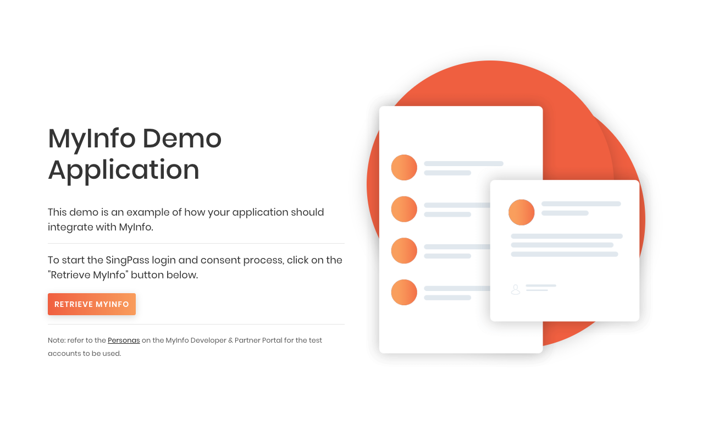

## MyInfo Demo App Setup

### 1.1 Install Node and NPM

In order for the demo application to run, you will need to install Node and NPM.

Follow the instructions given by the links below depending on your OS.

- [Install Node and NPM for Windows](http://blog.teamtreehouse.com/install-node-js-npm-windows)
- [Install Node and NPM for Linux](http://blog.teamtreehouse.com/install-node-js-npm-linux)
- [nstall Node and NPM for Mac](http://blog.teamtreehouse.com/install-node-js-npm-mac)


### 1.2 Run NPM install

Run the following command in the folder you unzipped the application:
```
npm install
```

### 1.3 Start the Application

**For Linux/MacOS**

Execute the following command to start the application:
```
  ./start.sh
```


**For Windows**

Execute the following command to start the application:
```
  .\start.bat
```


**Access the Application on Your Browser**
You should be able to access the sample application via the following URL:

```
http://localhost:3001
```




---
## Login with SingPass

Use this test ID and password to login to SingPass:

NRIC: ``S9812381D``
Password: ``MyInfo2o15``

---
## Enable PKI Digital Signature

<span style="color:red">
<strong>Note:</strong> <br>
As of version 2.2.0 of our API specifications, the URLs of the APIs have changed.
Please note the different configurations accordingly.
</span>


### v2.2 APIs (LATEST)

**For Linux/MacOS**

Edit the ``start.sh``. Look for ``SANDBOX ENVIRONMENT``, Comment out these configurations,
```
# SANDBOX ENVIRONMENT (no PKI digital signature)
# export AUTH_LEVEL=L0
# export MYINFO_API_AUTHORISE='https://sandbox.api.myinfo.gov.sg/com/v2/authorise'
# export MYINFO_API_TOKEN='https://sandbox.api.myinfo.gov.sg/com/v2/token'
# export MYINFO_API_PERSON='https://sandbox.api.myinfo.gov.sg/com/v2/person'
```

Look for ``TEST ENVIRONMENT``, uncomment these configurations,
```
# TEST ENVIRONMENT (with PKI digital signature)
export AUTH_LEVEL=L2
export MYINFO_API_AUTHORISE='https://test.api.myinfo.gov.sg/com/v2/authorise'
export MYINFO_API_TOKEN='https://test.api.myinfo.gov.sg/com/v2/token'
export MYINFO_API_PERSON='https://test.api.myinfo.gov.sg/com/v2/person'
```
Execute the following command to start the application:
```
  ./start.sh
```

**For Windows**

Edit the ``start.bat``. Look for ``SANDBOX ENVIRONMENT``, comment out these configurations,
```
rem SANDBOX ENVIRONMENT (no PKI digital signature)
rem set AUTH_LEVEL=L0
rem set MYINFO_API_AUTHORISE=https://sandbox.api.myinfo.gov.sg/com/v2/authorise
rem set MYINFO_API_TOKEN=https://sandbox.api.myinfo.gov.sg/com/v2/token
rem set MYINFO_API_PERSON=https://sandbox.api.myinfo.gov.sg/com/v2/person
```
Look for ``TEST ENVIRONMENT``, uncomment these configurations,
```
rem TEST ENVIRONMENT (with PKI digital signature)
set AUTH_LEVEL=L2
set MYINFO_API_AUTHORISE=https://test.api.myinfo.gov.sg/com/v2/authorise
set MYINFO_API_TOKEN=https://test.api.myinfo.gov.sg/com/v2/token
set MYINFO_API_PERSON=https://test.api.myinfo.gov.sg/com/v2/person
```
Execute the following command to start the application:
```
  .\start.bat
```

### v2.1 APIs - DEPRECATED

**For Linux/MacOS**

Edit the ``start.sh``. Look for ``L0 APIs``, Comment out these configurations,
```
# L0 APIs
# export AUTH_LEVEL=L0
# export MYINFO_API_AUTHORISE='https://myinfosgstg.api.gov.sg/dev/v2/authorise'
# export MYINFO_API_TOKEN='https://myinfosgstg.api.gov.sg/dev/v2/token'
# export MYINFO_API_PERSON='https://myinfosgstg.api.gov.sg/dev/v2/person'
```
Look for ``L2 APIs``, uncomment these configurations,
```
# L2 APIs
export AUTH_LEVEL=L2
export MYINFO_API_AUTHORISE='https://myinfosgstg.api.gov.sg/test/v2/authorise'
export MYINFO_API_TOKEN='https://myinfosgstg.api.gov.sg/test/v2/token'
export MYINFO_API_PERSON='https://myinfosgstg.api.gov.sg/test/v2/person'
```
Execute the following command to start the application:
```
  ./start.sh
```

**For Windows**

Edit the ``start.bat``. Look for ``L0 APIs``, comment out these configurations,
```
rem L0 APIs
rem set AUTH_LEVEL=L0
rem set MYINFO_API_AUTHORISE='https://myinfosgstg.api.gov.sg/dev/v2/authorise'
rem set MYINFO_API_TOKEN='https://myinfosgstg.api.gov.sg/dev/v2/token'
rem set MYINFO_API_PERSON='https://myinfosgstg.api.gov.sg/dev/v2/person'
```
Look for ``L2 APIs``, uncomment these configurations,
```
rem L2 APIs
set AUTH_LEVEL=L2
set MYINFO_API_AUTHORISE='https://myinfosgstg.api.gov.sg/test/v2/authorise'
set MYINFO_API_TOKEN='https://myinfosgstg.api.gov.sg/test/v2/token'
set MYINFO_API_PERSON='https://myinfosgstg.api.gov.sg/test/v2/person'
```
Execute the following command to start the application:
```
  .\start.bat
```

---

## Alternative Packages/Examples (Not Officials)
[Laravel (PHPFramework) Package](https://github.com/carro-public/myinfo)

## Reporting issues

You may contact [support@myinfo.gov.sg](mailto:support@myinfo.gov.sg) for any other technical issues, and we will respond to you within 5 working days.
